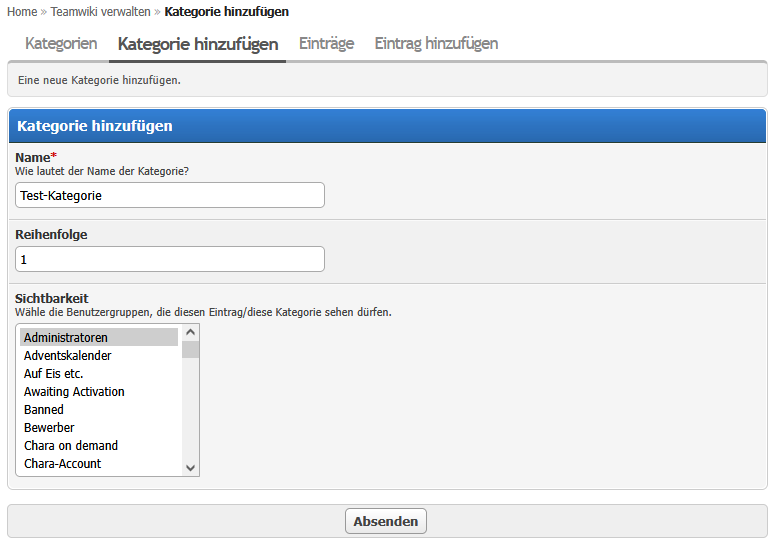
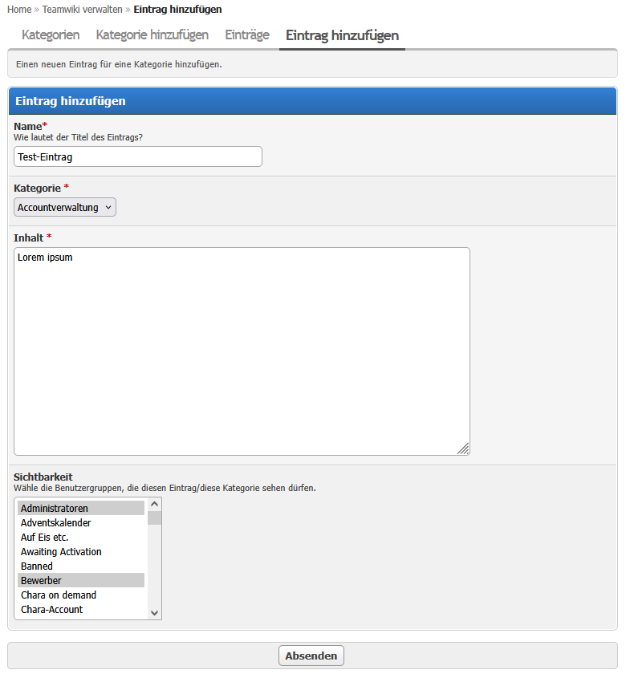
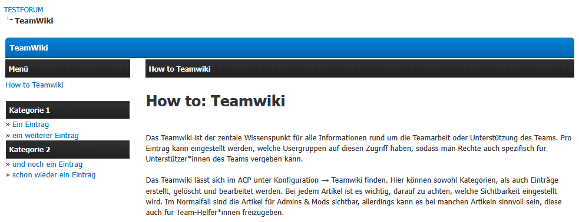

# TeamWiki

A simple team wiki for MyBB 1.8. Create categories and entries and restrict their
visibility to selected usergroups — ideal for staff/team documentation that only
certain groups (admins, moderators, event teams, …) should see. Everything is managed
from the Admin CP; members read the wiki on a dedicated `teamwiki.php` page that only
shows the entries their group is allowed to see.

## Requirements

- MyBB 1.8.x
- PHP 7.4 or higher (compatible with PHP 8.x)
- No dependencies on other plugins

## Installation

1. Upload the contents of the archive into your MyBB root directory, keeping the folder
   structure. The following files/folders are added:
   - `teamwiki.php`
   - `inc/plugins/teamwiki.php`
   - `inc/plugins/teamwiki_functions.php`
   - `inc/plugins/teamwiki/` (CSS + templates)
   - `inc/languages/english/teamwiki.lang.php` and `.../english/admin/teamwiki.lang.php`
   - `inc/languages/deutsch_du/teamwiki.lang.php` and `.../deutsch_du/admin/teamwiki.lang.php`
2. Go to **ACP → Configuration → Plugins**, find **TeamWiki** and click **Install & Activate**.
   This creates the database tables, installs the templates and registers the stylesheet
   in all themes.
3. Open **ACP → Configuration → TeamWiki** to start adding categories and entries.

## Usage

### First steps after activation

There are no global settings to configure. Content is organised as
**categories → entries**, both created in the ACP.

Open **ACP → Configuration → TeamWiki**. You will see four tabs:

- **Categories** – overview of all categories
- **Add category** – create a new category
- **Entries** – overview of all entries
- **Add entry** – create a new entry

### Managing categories

1. Go to **ACP → Configuration → TeamWiki → Add category**.
2. Fill in the fields:
   - **Name** – the category title shown in the front-end menu.
   - **Order** – lower numbers appear first in the menu.
   - **Visibility** – select the usergroups allowed to see this category. Leaving it
     empty makes the category visible to everyone (subject to entry-level visibility).
3. Click **Submit**.
4. To change or remove a category, use the **Options** menu on the **Categories** tab
   (**Edit** / **Delete**). Deleting a category also deletes all of its entries.

### Managing entries

1. Go to **ACP → Configuration → TeamWiki → Add entry**.
2. Fill in the fields:
   - **Name** – the entry title.
   - **Category** – the category this entry belongs to (required).
   - **Content** – the entry body. The MyCode editor lets you use BBCode, smilies and images.
   - **Visibility** – select the usergroups allowed to see this entry. If you leave it
     empty, the entry **inherits** the visibility of its category.
3. Click **Submit**.
4. Edit or delete existing entries via the **Options** menu on the **Entries** tab.

### Visibility model

- A **category** with no selected groups is a gate that is open to everyone.
- An **entry** with its own selected groups decides its visibility on its own — it can
  even be released to a group the category itself does not list.
- An **entry** with no selected groups inherits the category's groups.
- The front-end menu only lists categories that have at least one entry visible to the
  current user.

### Front end

Members visit **`https://your-forum/teamwiki.php`**. The left column shows the
navigation (categories and the entries visible to the user); the right column shows the
selected entry. Users without access to any entry get a "no permission" message.

## Uninstallation

1. Go to **ACP → Configuration → Plugins**.
2. Click **Deactivate** on TeamWiki (removes templates and the stylesheet).
3. Click **Uninstall** to drop the database tables
   (`teamwiki_categories`, `teamwiki_entries`, `teamwiki_entry_groups`).
4. Optionally delete the uploaded files listed under *Installation*.

## Changelog

See [CHANGELOG.md](CHANGELOG.md) for the full version history.
